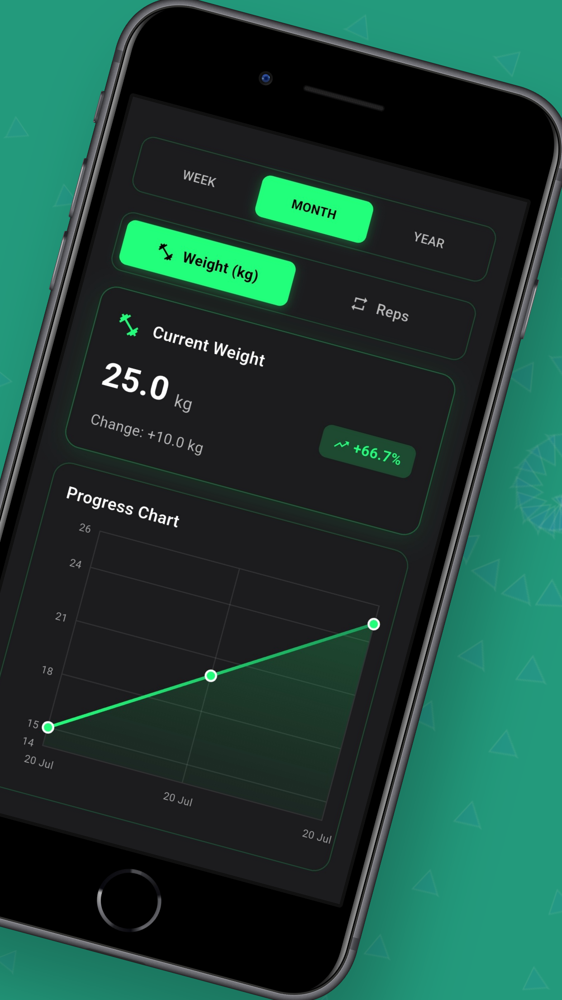
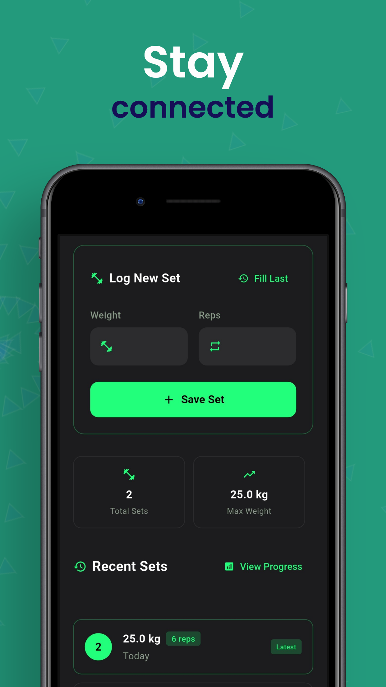
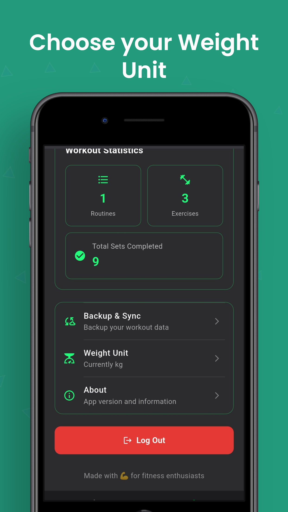

# Workout Logger (Flutter + Node.js)

A full-stack workout logging app:
- **Mobile app:** Flutter (`/workout_logger_app`)
- **Backend API:** Node.js (`/workout-logger-backend`)




## Repo Structure
- `workout_logger_app/` — Flutter mobile app
- `workout-logger-backend/` — Node.js backend API

## Features
- Log workouts (sessions)
- Track exercises, sets, reps, and weight
- View workout history
- Works with a dedicated backend API (Node.js)

> If your app supports auth, analytics, PR tracking, etc. add them here — don’t hide your best work.

---

## Getting Started

### 1) Run the Backend (Node.js)
```bash
cd workout-logger-backend
npm install
# one of these will exist depending on your package.json scripts:
npm run dev
# OR
npm start


cd workout_logger_app
flutter pub get
flutter run


---



